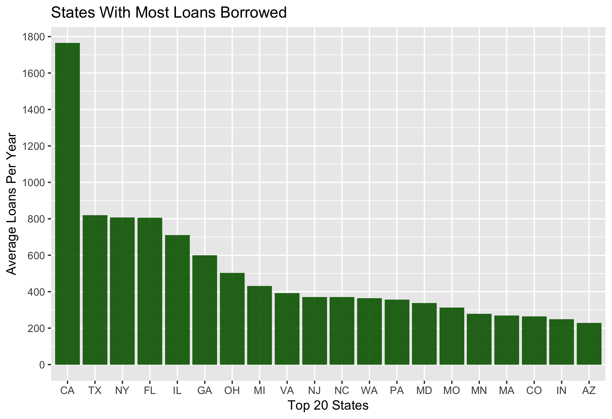

---
output:
  pdf_document: default
  word_document: default
  html_document: default
---
## Prosper Credit Loan Evaluation
**Paras Patel**

**6/15/19**

<br/>

#### Table of Contents
* Project Overview
* Data Overview
* Exploratory Data Analysis
* Results and Discussion  
<br/>

#### Project Overview  
The purpose of this project is to explore and visualize a dataset from an online loan company, Prosper Loan. Prosper Loan is a peer to peer marketplace that provides unsecured personal loans to interested borrowers and lenders looking to invest. Creditors can invest anywhere from $2,000 - $40,000. The goal of this analysis is to model and visualize key trends and relationships to help loaners mitigate risk based on features of the borrower.  
<br/>

#### Data Overview
The data source is provided by Udacity. The Prosper Loan dataset was last updated on March 11, 2014. Included with the dataset is a variable dictionary explaining all the features tracked by Prosper Loan. The dataset is comprised of approximately 114,000 entries and 81 variables. For this analysis, we will focus on the following features:  
  
* Listing Creation Date
* Borrower State
* Credit Grade
* Borrower APR
* Debt To Income Ratio
* Income Range
* Prosper Rating (Alpha)
* Estimated Loss
* Estimated Effective Yield
* Occupation
* Employment Status  
<br/>

```{r setup, include=FALSE}
knitr::opts_chunk$set(echo = TRUE)
```

```{r,include=FALSE,results='hide',warning=FALSE}
getwd()
setwd("/Users/paraspatel/Desktop/Udacity/Data Analysis With R/Project")
loan <- read.csv('prosperLoanData.csv')
length(subset(loan,is.na(loan),))

library(ggplot2)
library(dplyr)
library(memisc)
library(yaml)
library(corrplot)
library(lubridate)
library(RColorBrewer)

loan$ProsperRating..Alpha.[loan$ProsperRating..Alpha.==""] <- NA
loan$ProsperRating..Alpha. <- factor(loan$ProsperRating..Alpha.)

loan$BorrowerState[loan$BorrowerState==""] <- NA
loan$BorrowerState <- factor(loan$BorrowerState)

loan$CreditGrade[loan$CreditGrade.==""] <- NA
loan$CreditGrade <- factor(loan$CreditGrade)
```
#### EDA (Analysis)
<br/>
First, we'll examine the number of loans created by year and country. Prosper Loan experiences a huge spike in loan origination in 2013, most likely attributed to a settlement in a class action lawsuit and 2 major capital investments summing over $45 million. <br/>
The next plot shows the top 20 states by average loan origination. California is Prosper Loans leading market as of 2014, not suprising as Prosper is based out of San Francisco. Texas, New York, Florida, and Illinois are the next largest markets, respectively. 

<br/>

```{r,echo=FALSE,results='hide',warning=FALSE,fig.width=6,fig.height=4}
library(ggplot2)
loan$ListingCreationDate <- sapply(strsplit(as.character(loan$ListingCreationDate), "\\-"), `[`, 1)
loan$ListingCreationDate <- factor(loan$ListingCreationDate)

# Plot of Listing Creation Distribution - Univariate
ggplot(aes(x=ListingCreationDate),data=loan)+
  geom_bar(fill='red',alpha=0.9)+
  xlab('Listing Creation Year')+ylab('Frequency')+ggtitle('Listing Creation Distribution')
```

<br/>

```{r,include=FALSE,echo=FALSE,results='hide',warning=FALSE}

# Plot of Top 10 states with Most Average Loans
library(lubridate)

z<-subset(loan,!is.na(ListingCreationDate),)
z$ListingCreationDate <- ymd_hms(z$ListingCreationDate)
z$ListingCreationDate <- floor_date(z$ListingCreationDate,unit='month')

time.range <- (unclass(max(z$ListingCreationDate)-min(z$ListingCreationDate))/365)[1]
```

```{r,echo=FALSE,incude=FALSE,warning=FALSE,message=FALSE,results='hide'}
library(dplyr)
p<-loan %>%
  filter(!is.na(BorrowerState)) %>%
  count(BorrowerState) %>%
  arrange(desc(n))%>%
  top_n(20) %>% mutate(avg = as.integer(n/time.range))%>%
  ggplot(aes(x=reorder(BorrowerState,-avg),y=avg))+
  geom_bar(stat='identity',fill='darkgreen',alpha=0.9)+
  xlab('Top 20 States')+ylab('Average Loans Per Year')+ggtitle('States With Most Loans Borrowed')+
  scale_y_continuous(limits=c(0,1800),breaks=seq(0,1800,200))
```

```{r pressure, echo=FALSE, out.height='45%'}

```
\pagebreak  

Below, a bivariate relationship between Credit Grade and Borrower APR is illustrated. As expected, mean Borrower APR (Annual Percentage Rate) decreases with a better Credit Grade. The median APR for borrowers with an AA Credit Grade is 10%. On the other end, High Risk (HR) borrowers are hit with a median APR of 27% on their loans.

<br/>


```{r, echo=FALSE,results='hide',warning=FALSE,fig.width=6,fig.height=4}
ggplot(aes(x=CreditGrade,y=BorrowerAPR),data=subset(loan,!is.na(CreditGrade),))+
  geom_boxplot(fill='dodgerblue2')+
  geom_point(stat='summary',fun.y=mean,color='red',shape=1)+
  scale_y_continuous(limits=c(0,0.45),breaks=seq(0,0.45,0.05))+
  xlab('Credit Grade')+ylab('Borrower APR')+ggtitle('Credit Grade vs Borrower APR')
```
\pagebreak  

Here, we evaluate the Debt to Income Ratio's by Income Range class. Approximately 4% of all borrowers have a Debt To Income Ratio of 0.18 with a gradual decline at 0.22. The relationship is expected. Borrowers with higher incomes tend to have lower Debt to Income Ratios than borrowers in the lower income class. Little variation from the mean line and the $50,000-$75,000 income range group is observed, indicating sample size bias towards this group.

<br/>

```{r,echo=FALSE,results='hide',warning=FALSE,include=FALSE}
# Bivariate - Avg Debt to Income Ratio vs Income Range
x<-subset(loan,!is.na(DebtToIncomeRatio),select=c('IncomeRange','DebtToIncomeRatio')) %>% 
  group_by(IncomeRange,DebtToIncomeRatio) %>% 
  summarise(n=n()) %>% 
  mutate(freq = n / sum(n))
```

```{r, echo=FALSE,warning=FALSE,results='hide'}
ggplot(data=subset(x,IncomeRange!='Not displayed'& IncomeRange!='Not employed',),aes(x=DebtToIncomeRatio,y=freq))+
  geom_line(stat='Identity',aes(color=IncomeRange))+geom_line(stat='summary',fun.y=mean,linetype=2)+
  scale_x_continuous(limits=c(0,1),breaks=seq(0,1,0.1))+
  xlab('Debt To Income Ratio')+ylab('Proportion')+ggtitle('Debt To Income Ratio Distribution by Income Range')+
  labs(color='Income Range')
```
\pagebreak  

It's important for creditors to understand the potential risk's for a loan. The Estimated Loss is defined as the estimated principle loss on charge off's (an amount of debt unlikely to be collected due to delinquency). Prosper Loan provides a rating for loans with unspecified Credit Grades. Average loss' are skewed heavily towards High Risk borrowers (Mean Estimated Loss of >17%).

<br/>

```{r,echo=FALSE,fig.width=6,fig.height=4}
# Bivariate - Prosper Rating vs Estimated Loss 
y<-subset(loan,!is.na(ProsperRating..Alpha.),)

subset(y,!is.na(EstimatedLoss),select=c('EstimatedLoss','ProsperRating..Alpha.')) %>% 
  group_by(ProsperRating..Alpha.)%>%
  summarise(lossmean = mean(EstimatedLoss))%>%
  ggplot(aes(x=ProsperRating..Alpha.,y=lossmean))+
  geom_bar(stat='identity',fill='orange',alpha=0.85)+
  xlab('Prosper Rating')+ylab('Estimated Loss')+ggtitle('Mean Loss by Prosper Rating')+
  labs(color='Prosper Rating Alpha')+
  scale_y_continuous(breaks=seq(0,0.2,0.02))
```
\pagebreak  

Creating a linear model with Prosper Rating and Borrower APR as responses and Estimated Loss as the predictor, an R-squared of 0.95 and p-value of ~0 are computed, with a residual error of 0.01 (Note the model relationship). R-squared and p-value suggest a strong correlation, however, it's important to note the residual standard error is significant (~10% of the mean/median). The model is still able to provide a fair range for Estimated Loss given these two predictors.

<br/>

```{r,echo=FALSE,fig.width=6,fig.height=4}
model = lm(y$EstimatedLoss ~ exp((y$BorrowerAPR)^1.25) + y$ProsperRating..Alpha.)
summary(model)
```
\pagebreak 

The linear model between these 3 variables are plotted out below. The relationship between Borrower APR and Estimated Loss can be better expressed as exponential than linear.

<br/>

```{r, echo=FALSE,results='hide',warning=FALSE}
# Multivariate - Borrower APR vs Estimated Loss by Prosper Rating
subset(y,!is.na(EstimatedLoss) & !is.na(BorrowerAPR),select=c('EstimatedLoss','BorrowerAPR','ProsperRating..Alpha.')) %>% 
  ggplot(aes(x=BorrowerAPR,y=EstimatedLoss))+
  geom_point(aes(color=ProsperRating..Alpha.),alpha=0.02)+
  scale_color_brewer(palette='Set1')+
  xlab('Borrower APR')+ylab('Estimated Loss')+ggtitle('Borrower APR vs Estimated Loss By Prosper Rating')+
  labs(color='Prosper Rating Alpha')+
  guides(colour = guide_legend(override.aes = list(alpha = 1)))+
  scale_y_continuous(breaks=seq(0,0.4,0.05),limits=c(0,0.3))+
  scale_x_continuous(breaks=seq(0,0.5,0.05))+
  geom_smooth(method="lm", formula= (y ~ exp(x^1.25)), se=FALSE, color='black')
```
\pagebreak

Estimated Effective Yield is equal to the borrower interest rate minus (the servicing fee rate and estimated uncollected interest on charge-offs) plus estimated collected late fees. A heat map of Employment Status, Occupation, and Estimated Effective Yield indicates no clear correlation. Therefore, a creditor can use this heatmap to generalize potential profitability from borrowers based on occupation and employment status.

<br/>

```{r, echo=FALSE,results='hide',fig.width=9,fig.height=6.5}
# Heat Map of Employment Status, Occupation, and Estimated Effective Yield
subset(y,!is.na(EstimatedEffectiveYield)&!is.na(EmploymentStatus)&!is.na(BorrowerAPR) & EmploymentStatus %in% c('Employed','Full-time','Self-employed'),select=c('Occupation','EstimatedEffectiveYield','EmploymentStatus')) %>% 
  ggplot(aes(y=Occupation, x=EmploymentStatus,fill=EstimatedEffectiveYield)) + 
  geom_tile()+ scale_fill_gradient(low = "white",high = "black")+
  xlab('')+ylab('')+ggtitle('Heat Map - Effective Yield by Occupation and Employment Status')+
  labs(fill='Estimated Effective Yield',size=10)+
  theme(axis.text.y = element_text(size=5),axis.text.x = element_text(angle=45,hjust=1),
        plot.title = element_text(size=10.5))
```
\pagebreak

#### Results and Discussion
In this analysis, we analyzed a few critical metrics from Prosper Loan's trade data for the purpose of helping lenders understand borrower demographic and features to mitigate risk and increase profitability.

Prosper Loan's largest market is in its home state of California. Borrowers with better credit grades typically receive lower APR on their loans, however, there are cases where they receive APR's as high as 30%, which is what we would would expect for High Risk borrowers. 

We also analyzed the bivariate relationship between Debt To Income Ratio and Income Range. Typical Debt To Income Ratio for all income range classes fall at roughly 0.18 with borrowers with $100k+ income having the smallest range.

Another valuable relationship for lenders to be aware of is the Estimated Loss by Prosper Rating. Prosper Loan uses a proprietary risk rating system. Lenders can take advantage of the data here to determine estimated loss's (principle loss on charge-off) for their loans based on the borrowers rating.

Finally, a heat map was created correlating Estimated Effective Yield for the lenders based on the Borrowers Occupation and Employment Status. Even though this is a generalization, lenders can use this as a potential guideline to evaluate certain investing opportunities before deeper investigation. 


